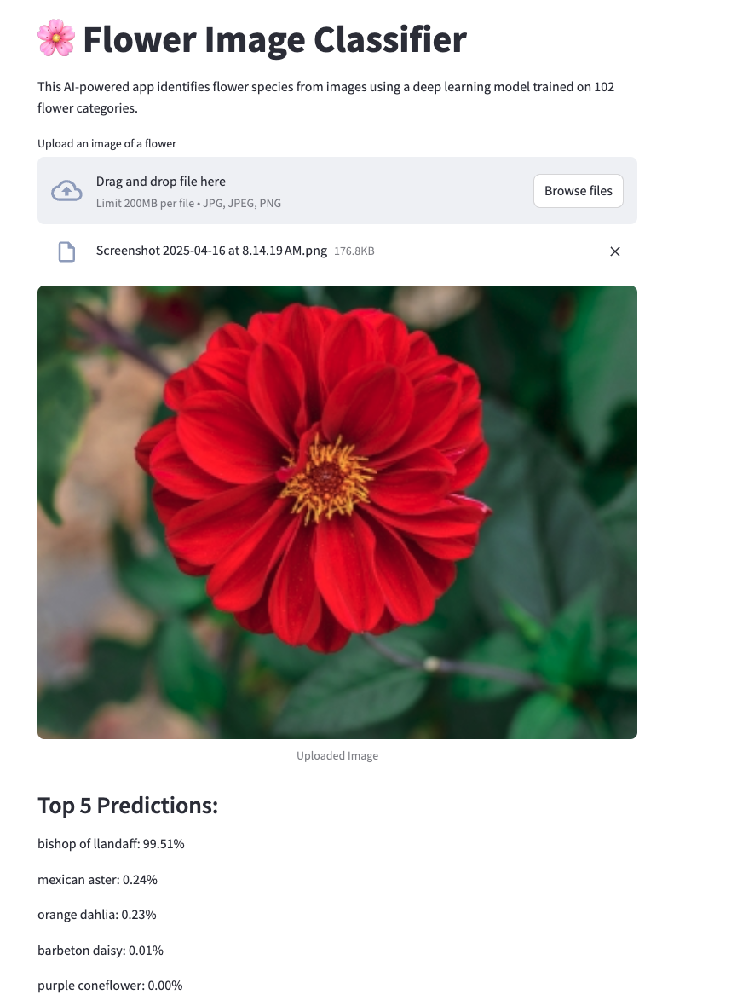

# Flower Image Classifier – Deep Learning with PyTorch

This project classifies flower species using a convolutional neural network trained on the Oxford 102 Flower dataset. It demonstrates practical skills in transfer learning, data preprocessing, model evaluation, and web-based deployment using Streamlit.

The project was developed as part of the Udacity Data Scientist Nanodegree program.

**Live demo:**  
https://alrod2025-flower-clasifier-app.streamlit.app

---

## Project Overview

- Model: VGG16 (with transfer learning)
- Dataset: Oxford 102 Flower Categories
- Classes: 102 flower species
- Accuracy: ~70%+ on the test set
- Deployment: Streamlit Cloud
- Device: Compatible with CPU and GPU

---

## Project Structure

```
.
├── app.py                         # Streamlit web app
├── checkpoint.pth                # Trained model checkpoint (downloaded at runtime)
├── flower_classifier_rebuild.ipynb  # Jupyter Notebook for training and testing
├── cat_to_name.json              # Mapping from class index to flower name
├── requirements.txt              # Project dependencies
└── README.md                     # Project documentation
```

---

## Features

- Transfer learning using a pretrained VGG16 model
- Image preprocessing pipeline (resize, crop, normalize)
- Top-5 prediction with confidence scores
- Sanity check with visual output
- Streamlit web app deployment
- Model file is automatically downloaded from Google Drive

---

## Try It in Google Colab

[Open in Colab](https://colab.research.google.com/github/alrod2025/flower-clasifier-app/blob/main/flower_classifier_rebuild.ipynb)

---

## Installation

To run the app locally:

```bash
git clone https://github.com/alrod2025/flower-clasifier-app.git
cd flower-clasifier-app
pip install -r requirements.txt
streamlit run app.py
```

---

## Example Output

An uploaded image is classified into the top five most probable flower species, each with a confidence score.




---

## Acknowledgements

- Oxford 102 Flower Dataset
- Udacity Data Scientist Nanodegree
- Pretrained models from `torchvision.models`

---

## License

This project is licensed under the MIT License and is intended for educational use.
